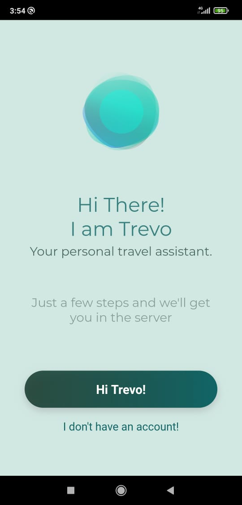
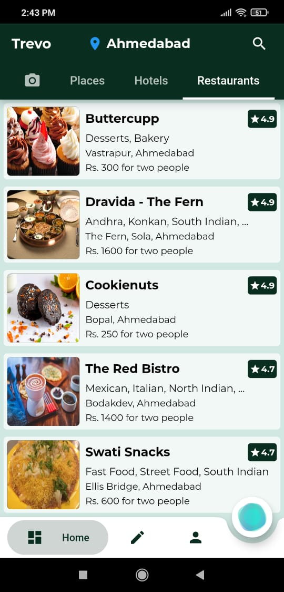
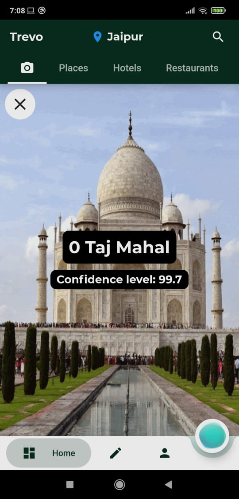
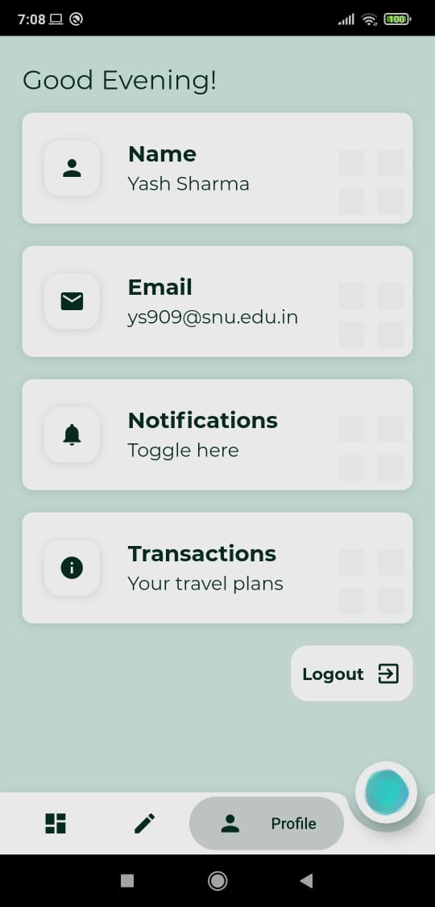
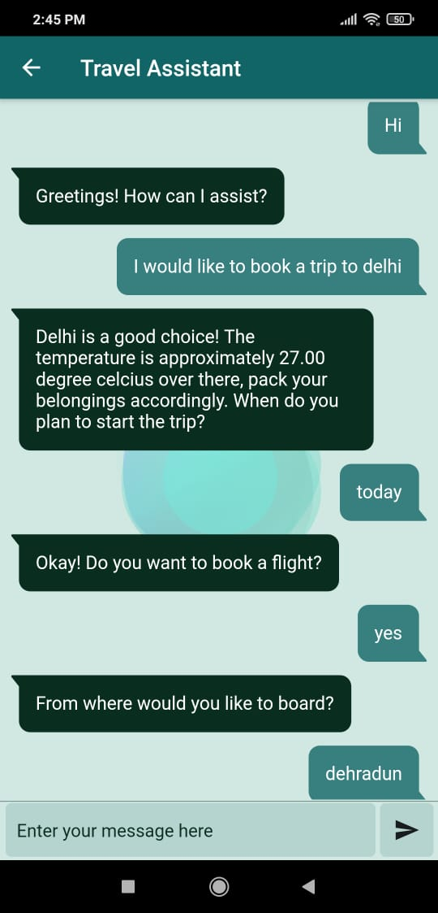
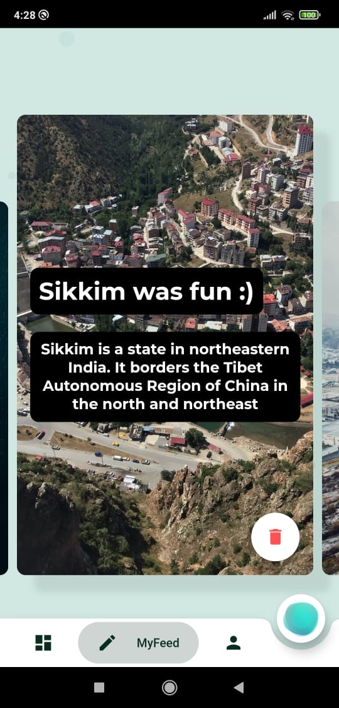
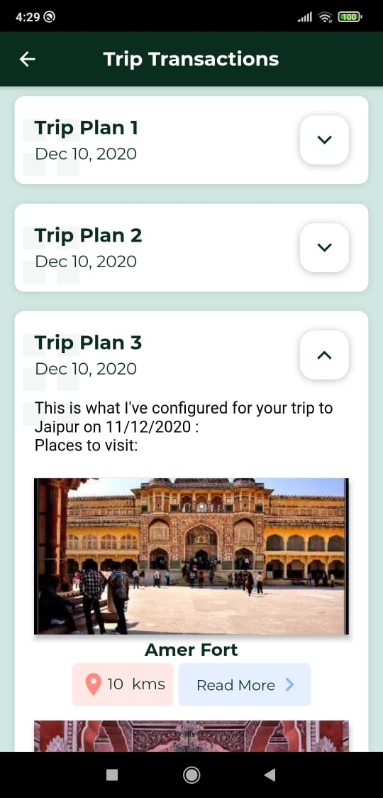
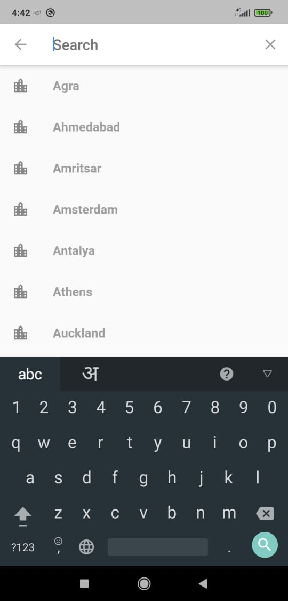

# Trevo
#### - Personal travel assistant

Trevo is a cross platform travel application. Users can look for hotels,restaurants and popular places to visit. The app is backed up with an AI chatbot to configure travel plans. App also allows people to recognize monuments using a machine learning model. Apart from this people can save their travel stories. The app is integrated with some other features as well.
Apps are boring until they have animation in them. Trevo comes with a user friendly UI backed up with good animations.

# Features!

  - Query places, hotels and restaurants
  - Configure travel plans using the chat bot
  - Detect monuments using camera
  - Create and edit travel stories
  - Notifications
  - Search for different cities

# Tech Stack

| Target | Stack |
| ------ | ------ |
| Front end | Flutter |
| Chat bot | Dialogflow |
| Chat bot server | NodeJS |
| Monument detection | Tensor flow lite |
| Backend | Firebase |

# Sneak Peek

   
   

# Getting Started

A few resources to get you started if this is your first Flutter project:

- [Lab: Write your first Flutter app](https://flutter.dev/docs/get-started/codelab)
- [Cookbook: Useful Flutter samples](https://flutter.dev/docs/cookbook)

For help getting started with Flutter, view flutter's
[online documentation](https://flutter.dev/docs), which offers tutorials,
samples, guidance on mobile development, and a full API reference.

License
----

MIT

**Free Software, Hell Yeah!**

